# 🛒 BigMart Sales Prediction App ML Project

[](https://www.python.org/)
[](https://streamlit.io/)
[](https://opensource.org/licenses/MIT)

This project showcases a complete **Machine Learning pipeline** using BigMart retail sales data.  
It includes automated data ingestion, MySQL database setup, model training, and deployment using a modern Streamlit application.

👉 **Live Demo:** [](https://ml-bigmart-sales-prediction-aditya-jadhav.streamlit.app/)

---

## 📌 Project Overview

Retail sales depend on a variety of factors such as product type, store characteristics, pricing, location, and visibility.  
This application predicts the **expected sales** for a specific **product + outlet** combination using trained ML regression models.

The project demonstrates a complete end-to-end ML workflow suitable for Data Analyst / Data Scientist portfolios.

---

## 🧱 Architecture Overview

```mermaid
flowchart TD
    subgraph Ingestion [📥 Data Ingestion]
        A1[📄 df_item.xml] --> A4[(MySQL: item_info)]
        A2[📄 df_outlet.xml] --> A5[(MySQL: outlet_info)]
        A3[📄 df_sales.xml] --> A6[(MySQL: sales_info)]
    end

    subgraph Processing [⚙️ Data Processing]
        A4 --> B1[🔗 Merge Tables]
        A5 --> B1
        A6 --> B1
        B1 --> B2[🧹 Cleaning & Feature Engineering]
        B2 --> B3[🔀 Train/Test Split]
    end

    subgraph Modeling [🤖 Model Training]
        B3 --> C1[📈 GradientBoostingRegressor]
        C1 --> C2[💾 Save bigmart_best_model.pkl]
    end

    subgraph Deployment [🚀 Streamlit App]
        C2 --> D1[🌐 Streamlit Web Interface]
        D1 --> D2[📊 Predict Sales]
    end
```


---

## ✨ Features

* Clean and modern Streamlit UI

* Automated data preprocessing

* End-to-end ML pipeline ready for production

* Real-time sales prediction output

* Top feature importance display (Explainability)

* CSV upload support for batch predictions

* Downloadable prediction results

---

## 🛠️ Tech Stack

| Component        | Technology Used      |
| ---------------- | -------------------- |
| Language         | Python               |
| UI Framework     | Streamlit            |
| Machine Learning | Scikit-learn         |
| Data Handling    | Pandas, NumPy        |
| Visualization    | Matplotlib / Seaborn |
| Deployment       | Streamlit Cloud      |

---

## 📊 Dataset

Dataset used: BigMart Sales Dataset
Contains product characteristics, store attributes, and historical sales information.

**Key Columns:**

* Item Identifier
* Item Weight
* Item MRP
* Outlet Identifier
* Outlet Size, Type, and Location
* Item Visibility
* Item Outlet Sales (Target Variable)

---

## ⚡ Model Workflow

1. Data Cleaning and Preprocessing
2. Handling Missing Values
3. Feature Encoding
4. Train-Test Split
5. Model Training (Random Forest / GradientBoosting / Linear Regression)
6. Hyperparameter Tuning
7. Evaluation and Deployment

---

## 💻 Installation and Local Run

```bash
# Clone the repository
git clone https://github.com/AdityaJadhav-ds/ml-bigmart-sales-prediction.git
cd ml-bigmart-sales-prediction.git

# Install dependencies
pip install -r requirements.txt

# Run the Streamlit app
streamlit run app.py

```

---

## 🧑‍💻 Author

**Aditya Jadhav**

